# 🎵 Concert Tour Data Cleaning & Analysis (Excel Project)


## 📌 Project Overview

This project focuses on cleaning and analyzing a messy concert tour dataset to extract meaningful business insights. The dataset was transformed from a raw, inconsistent format into a structured and analysis-ready dataset using Excel.

The final output includes a fully interactive dashboard showcasing key metrics such as revenue trends, top artists, and performance analysis.

---

## 🎯 Project Objectives
- Clean and standardize a messy dataset
- Handle missing values, duplicates, and formatting issues
- Transform raw data into structured format
- Perform exploratory data analysis (EDA)
- Build an interactive Excel dashboard
- Generate actionable insights

---

## 🛠 Tools Used
- Excel
- Pivot Tables
- Excel Formulas (VALUE, IF, LEFT, RIGHT)
- Data Cleaning Techniques
- Data Visualization (Charts & Dashboard)

---

## 📁 Project Structure

```text
START ─────────────────────────────────────────────

Tour Revenue Analysis Dashboard/
│
├── Analysis/
│   └── Screenshot/
│       ├── end_year_1.png
│       ├── revenue_per_show.png
│       ├── start_year.png
│       ├── tour_duration.png
│       └── year_range.png
│
├── Cleaning/
│   └── Screenshot/
│       ├── adjusted_Gross_number.png
│       ├── average_gross_number.png
│       ├── end_year_value.png
│       ├── extra_columns.png
│       ├── gross_footnotes.png
│       ├── gross_number.png
│       ├── rank_duplicate_1.png
│       ├── rank_duplicate_2.png
│       ├── start_year_trim.png
│       ├── start_year_value.png
│       ├── tour_title_trim.png
│       └── tourtitle_symbol.png
│
├── Dashboard/
│   └── Screenshot/
│       └── dashboard.png
│
├── Data/
│   ├── Clean/
│   │   └── Screenshot/
│   │       ├── clean.png
│   │       ├── clean_1.png
│   │       └── rank_duolicate.png
│   │
│   └── Raw/
│       └── Screenshot/
│           └── raw.png
│
└── README.md

END ─────────────────────────────────────────────
```

## 📂 Dataset Information
- Source: Kaggle
- Dataset Name: Dirty Dataset for Data Cleaning Practice
- Link: https://www.kaggle.com/datasets/amruthayenikonda/dirty-dataset-to-practice-data-cleaning
- Description: A purposely messy dataset containing concert tour data, designed for practicing data cleaning skills. It includes inconsistencies such as  symbols, missing values, incorrect formats, and duplicate rankings.
- License: CC0: Public Domain

---

## Full Data Analytics Pipeline
---
### Step 1: Bringing Data
⚠️ Issues in Raw Data
- Duplicate value in Rank column
- Broken ranking sequence
- Currency symbols ($) and commas in numeric columns
- Footnotes like [x], [b], [e]
- Special symbols (†, ‡, *) in text fields
- Inconsistent Year formats (single year vs range)
- Formatting Issues
- Numeric columns stored as text

---

**Raw Data**
Screenshot:
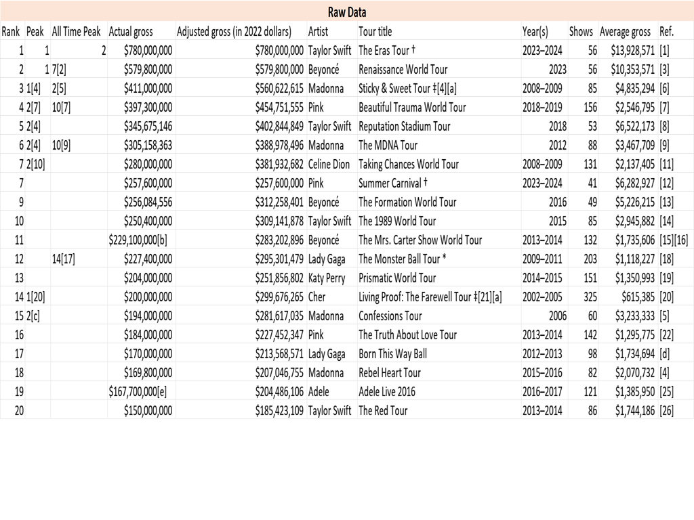

---

### Step 2: Data Cleaning and Formatting
The following cleaning steps are performed to clean the above raw data set to ensure data accuracy and consistency.

#### 1. Remove Unnecessary Columns
- Peak
- All Time Peak
- Ref

Screenshot:
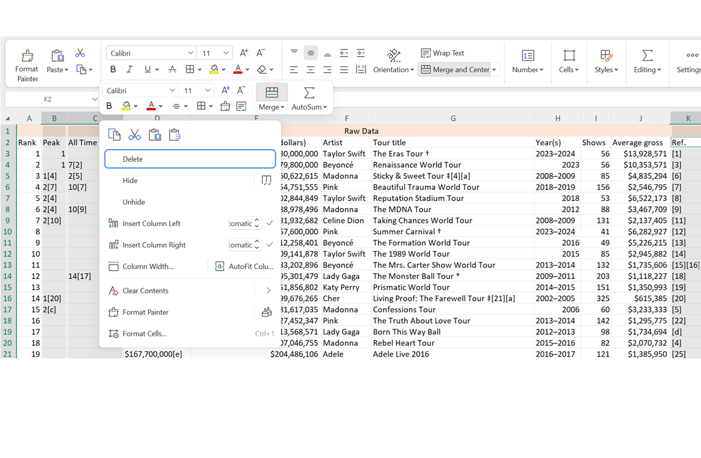

---

#### 2. Rank Column Fix
- Removed duplicate value (7 → corrected to 8)
- Fixed sequence (1–20 continuous)

Screenshot:
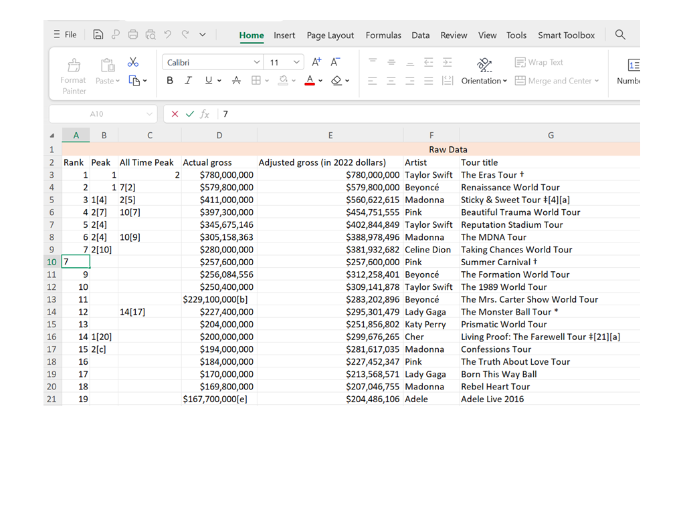

Screenshot:
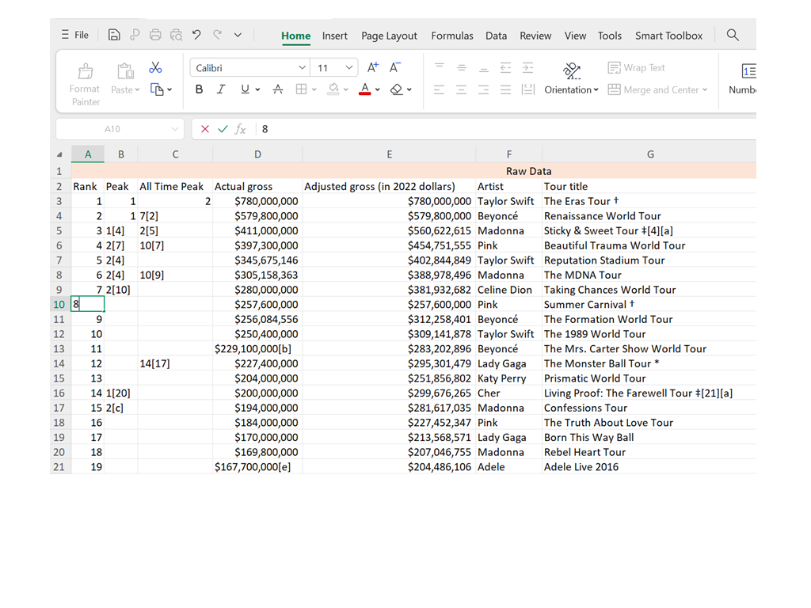


---

#### 3. Actual_Gross Cleaning

Steps performed:

- Removed $ using Find & Replace
- Removed commas ,
- Removed footnotes [b], [e]
- Converted to numeric

Screenshot:
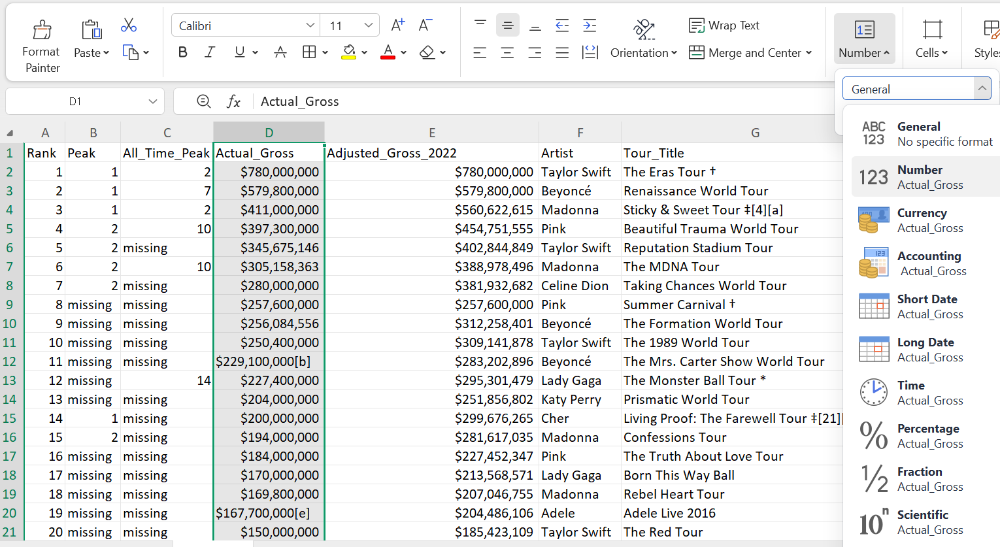

Screenshot:
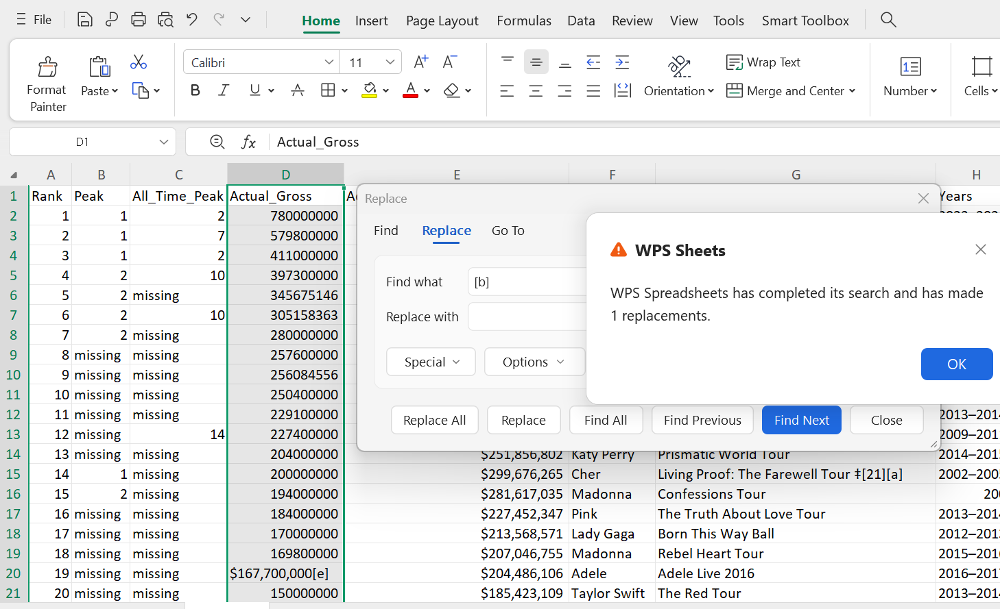

---

#### 4. Adjusted_Gross Cleaning

Steps performed:

- Removed $ using Find & Replace
- Removed commas

Screenshot:
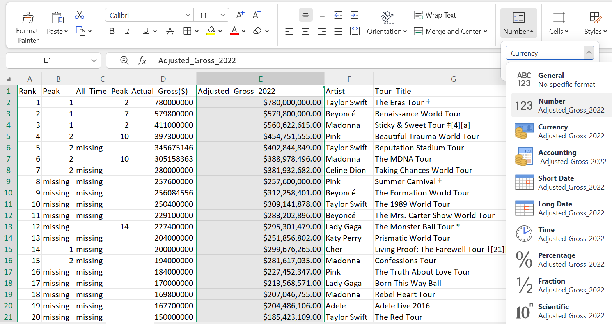

---

#### 5. Tour Title Cleaning

Removed symbols using Find & Replace:

- †, ‡, *
- [4], [a], [21]

Screenshot:
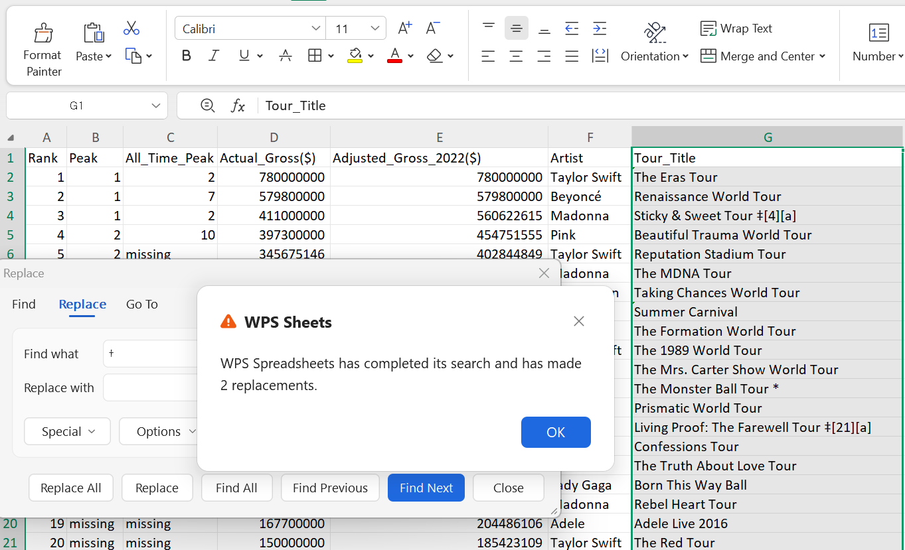

---

#### 6. Years Column Transformation
##### Converted single year to range using formula:
**Formula:**
```excel
= IF(ISNUMBER(FIND("–",H2)),H2,H2&"–"&H2)
````
2012 → 2012–2012

Screenshot:
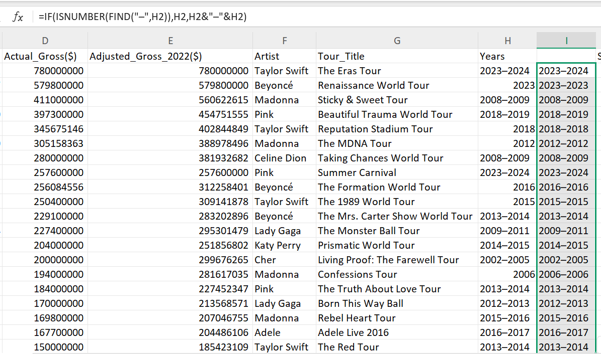

##### Created new columns:
- Start_Year USING FORMULA:

**Formula:**
```excel
= LEFT(H2,4)
````

Screenshot:
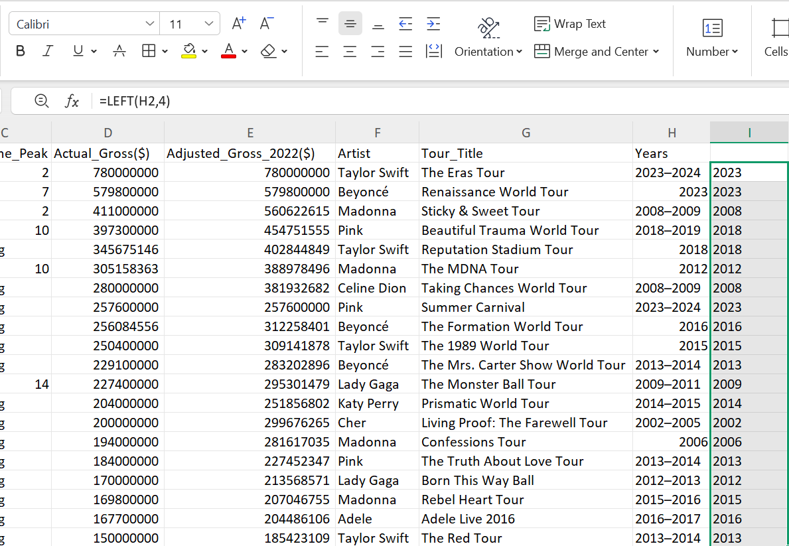

- End_Year USING FORMULA:

**Formula:**
```excel
= IF(ISNUMBER(FIND("–",H2)),RIGHT(H2,4),H2)
````

Screenshot:
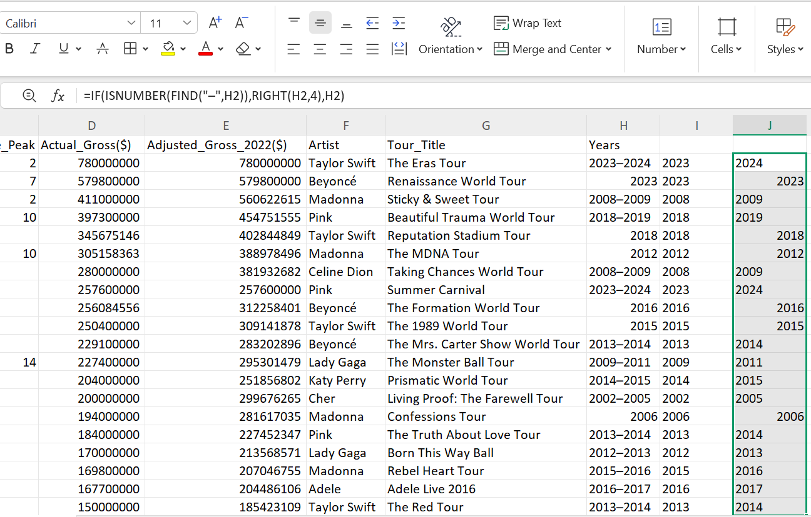

- Converted to numeric USING FORMULA:

**Formula:**
```excel
= VALUE(I2)
````

Screenshot:
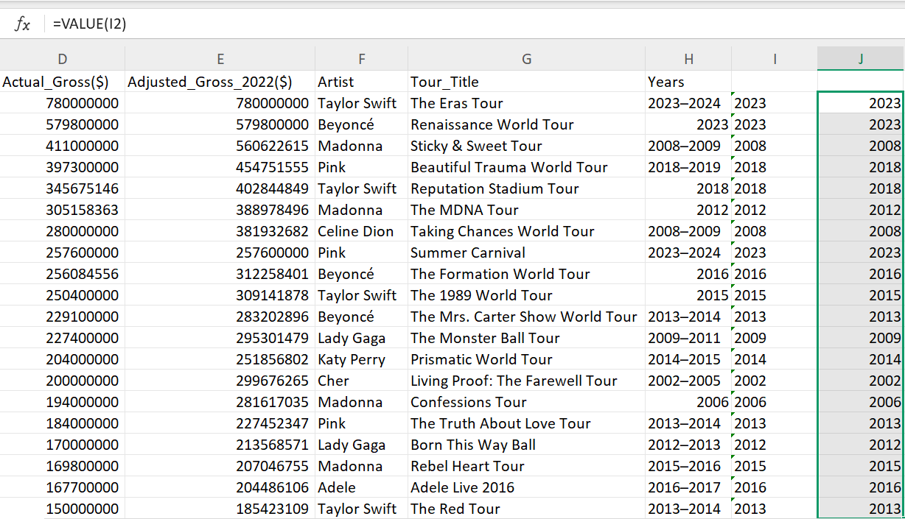

**Formula:**
```excel
= VALUE(J2)
````

Screenshot:
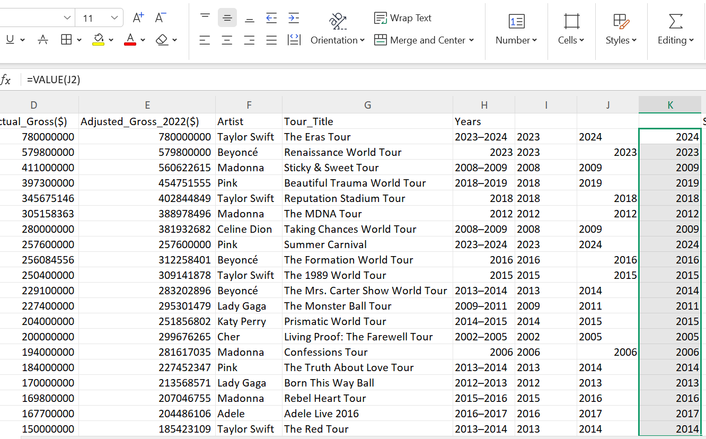

---

##### Removed original Years column and additional range column

---


---
## Clean Dataset Columns:
- Rank
- Artist
- Tour_Title
- Start_Year
- End_Year
- Shows
- Actual_Gross
- Adjusted_Gross
- Avg_Gross

**Clean Data**
Screenshot:
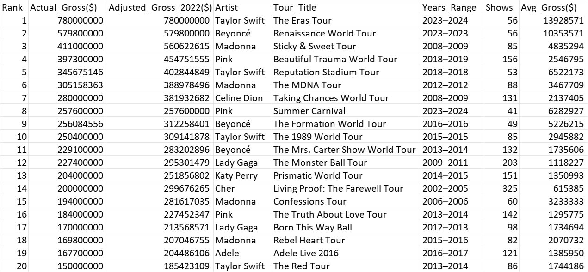

---

## Step 3. ⚙️ Preparing for Analysis
---
### ➕ Dataset Enhancement by adding Helper Columns
- Tour Duration USING FORMULA:

**Formula:**
```excel
= G2 - F2 + 1
````

Screenshot:
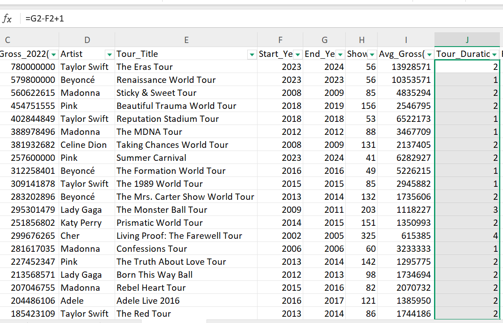

- Revenue per Show USING FORMULA:

**Formula:**
```excel
= B2/H4
````

Screenshot:
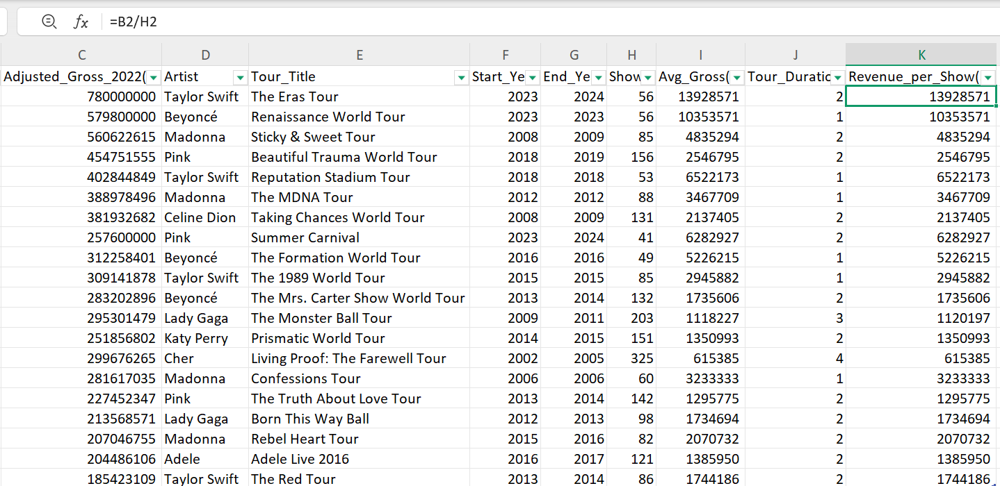

---

### Step 4: Bringing data into a visualization tool
---
#### 1. Top Earning Artists
- Rows → Artist
- Values → Sum of Actual_Gross

👉 Identifies highest revenue-generating artists

---

#### 2. Top Tours
- Rows → Tour_Title
- Values → Actual_Gross

👉 Shows highest grossing tours

---

#### 3. Shows vs Revenue
- Rows → Shows
- Values → Actual_Gross

👉 Analyzes relationship between shows and revenue

---

#### 4. Revenue Over Time
- Rows → Start_Year
- Values → Sum of Actual_Gross

👉 Identifies growth trends

---

#### 5. Average Gross Comparison
- Rows → Artist
- Values → Avg_Gross

👉 Compares earnings per show

---

### Step 5: Visualizing Data by Pivot Charts

Visualized Insights by creating Pivot Charts from above Pivot Tables created

---

#### 💡 Key Insights Generated

- Revenue strongly correlates with number of shows
- Some artists generate higher revenue per show despite fewer performances
- Revenue trends show growth over recent years
- Top tours contribute a major portion of total revenue

---

## Step 6: 📈 Dashboard
### 🧾 Layout Structure
#### 🔷 Top Section (KPIs)
- Total Revenue
- Total Shows
- Number of Artists
- Average Revenue per Show
#### 🔷 Middle Section (Charts)
- Top Artists 
- Revenue Trend
#### 🔷 Bottom Section (Charts)
- Top Tours
- Shows vs Revenue 
#### 🔷 Side Panel (Slicers)
- Artist
- Year

---

Dashboard Screenshot:
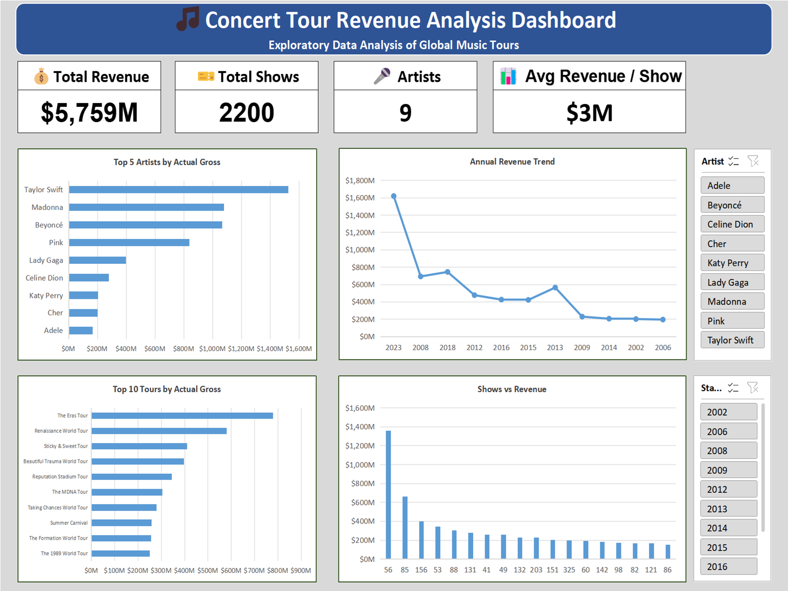

---

## 🚀 Conclusion

This project demonstrates strong skills in:

- Data cleaning
- Data transformation
- Excel-based analysis
- Dashboard creation

It highlights how raw, messy data can be turned into valuable insights through structured processing.

---


