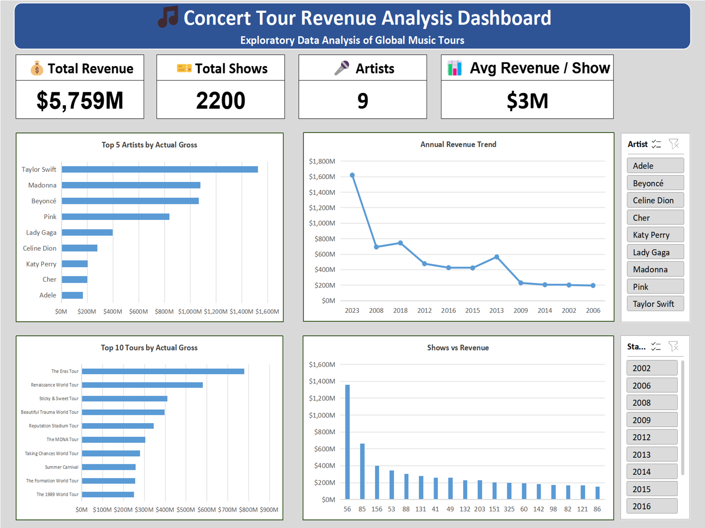

# 🎵 Concert Tour Data Cleaning & Analysis (Excel Project)


## 📌 Project Overview

This project focuses on cleaning and analyzing a messy concert tour dataset to extract meaningful business insights. The dataset was transformed from a raw, inconsistent format into a structured and analysis-ready dataset using Excel.

The final output includes a fully interactive dashboard showcasing key metrics such as revenue trends, top artists, and performance analysis.

---

## 🎯 Business Problem
 
*(Simulated scenario — the dataset is a public Kaggle practice dataset, but the project is framed the way a real stakeholder request would be.)*
 
A concert promotion agency wants to understand which artists and tours have historically generated the most revenue, whether more shows actually translates to more revenue, and how revenue has trended over time — to guide future booking decisions.

## 🎯 Project Objectives
- Clean and standardize a messy dataset
- Handle missing values, duplicates, and formatting issues
- Transform raw data into structured format
- Perform exploratory data analysis (EDA)
- Build an interactive Excel dashboard
- Generate actionable insights

---

## 🛠 Tools Used
- Excel
- Pivot Tables
- Excel Formulas (VALUE, IF, LEFT, RIGHT)
- Data Cleaning Techniques
- Data Visualization (Charts & Dashboard)

---

## 🧭 Workflow
 
```
Raw Data (Kaggle, messy)
        │
        ▼
 Clean & Format
 (remove columns, fix rank, strip symbols/footnotes,
  convert currency text to numbers, split years)
        │
        ▼
 Enhance
 (Tour_Duration, Revenue_per_Show columns added)
        │
        ▼
 Analyze
 (PivotTables — top artists, top tours, shows vs revenue,
  revenue over time, average gross comparison)
        │
        ▼
 Visualize
 (Pivot Charts + Dashboard with KPIs and slicers)
        │
        ▼
 Insights → Recommendations → Business Impact
```

---

## 📁 Project Structure

```
end-to-end-data-analysis-project/
│
├── Analysis/
│   └── screenshot/
│       ├── end_year_1.png
│       ├── revenue_per_show.png
│       ├── start_year.png
│       ├── tour_duration.png
│       └── year_range.png
│
├── cleaning/
│   └── screenshot/
│       ├── adjusted_Gross_number.png
│       ├── average_gross_number.png
│       ├── end_year_value.png
│       ├── extra_columns.png
│       ├── gross_footnotes.png
│       ├── gross_number.png
│       ├── rank_duplicate_1.png
│       ├── rank_duplicate_2.png
│       ├── start_year_trim.png
│       ├── start_year_value.png
│       ├── tour_title_trim.png
│       └── tourtitle_symbol.png
│
├── dashboard/
│   └── screenshot/
│       └── dashboard.png
│
├── data/
│   ├── clean/
│   │   └── screenshot/
│   │       ├── clean.png
│   │       ├── clean_1.png
│   │       └── rank_duplicate.png
│   │
│   └── raw/
│       └── screenshot/
│           └── raw.png
│
└── Readme.md
```

---

## 📂 Dataset Information
- Source: Kaggle
- Dataset Name: Dirty Dataset for Data Cleaning Practice
- Link: https://www.kaggle.com/datasets/amruthayenikonda/dirty-dataset-to-practice-data-cleaning
- Description: A purposely messy dataset containing concert tour data, designed for practicing data cleaning skills. It includes inconsistencies such as  symbols, missing values, incorrect formats, and duplicate rankings.
- License: CC0: Public Domain

---

## Full Data Analytics Pipeline
---
### Step 1: Bringing Data
⚠️ Issues in Raw Data
- Duplicate value in `Rank` column
- Broken ranking sequence
- Currency symbols ($) and commas in numeric columns
- Footnotes like `[x]`, `[b]`, `[e]`
- Special symbols (†, ‡, *) in text fields
- Inconsistent Year formats (single year vs range)
- Numeric columns stored as text

---

**View Screenshot**

[Raw Dataset](data/raw/screenshot/raw.png)

---

### Step 2: Data Cleaning and Formatting
The following cleaning steps are performed to clean the above raw data set to ensure data accuracy and consistency.

#### 1. Remove Unnecessary Columns
- Peak
- All Time Peak
- Ref

**View Screenshot**

[Removing Unnecessary_Columns](cleaning/screenshot/extra_columns.png)

---

#### 2. Rank Column Fix
- Removed duplicate value (7 → corrected to 8)
- Fixed sequence (1–20 continuous)

**View Screenshot**

[Rank Column Fix_1](cleaning/screenshot/rank_duplicate_1.png)

[Rank Column Fix_2](cleaning/screenshot/rank_duplicate_2.png)

---

#### 3. Actual_Gross Cleaning

Steps performed:

- Removed $ using Find & Replace
- Removed commas ,
- Removed footnotes [b], [e]
- Converted to numeric

**View Screenshot**

[Removing footnotes](cleaning/screenshot/gross_footnotes.png)

[Converting to numeric](cleaning/screenshot/gross_number.png)

---

#### 4. Adjusted_Gross Cleaning

Steps performed:

- Removed $ using Find & Replace
- Removed commas

**View Screenshot**

[Adjusting_Gross](cleaning/screenshot/adjusted_Gross_number.png)

---

#### 5. Tour Title Cleaning

Removed symbols using Find & Replace:

- †, ‡, *
- [4], [a], [21]

**View Screenshot**

[Removing Unwanted Symbols](cleaning/screenshot/tourtitle_symbol.png)

---

#### 6. Years Column Transformation
##### Converted single year to range using formula:
**Formula:**
```excel
= IF(ISNUMBER(FIND("–",H2)),H2,H2&"–"&H2)
````
2012 → 2012–2012

**View Screenshot**

[Single Year to Range](Analysis/screenshot/year_range.png)

##### Created new columns:
- Start_Year USING FORMULA:

**Formula:**
```excel
= LEFT(H2,4)
````

**View Screenshot**

[Start_Year](Analysis/screenshot/start_year.png)

- End_Year USING FORMULA:

**Formula:**
```excel
= IF(ISNUMBER(FIND("–",H2)),RIGHT(H2,4),H2)
````

**View Screenshot**

[End_Year](Analysis/screenshot/end_year_1.png)

- Converted to numeric USING FORMULA:

**Formula:**
```excel
= VALUE(I2)
````

**View Screenshot**

[Converting Start Year to numeric](cleaning/screenshot/start_year_value.png)

**Formula:**
```excel
= VALUE(J2)
````

**View Screenshot**

[Converting End Year to numeric](cleaning/screenshot/end_year_value.png)

---

##### Removed original Years column and additional range column

---


---
## Clean Dataset Columns:
- Rank
- Artist
- Tour_Title
- Start_Year
- End_Year
- Shows
- Actual_Gross
- Adjusted_Gross
- Avg_Gross

**View Screenshot**

[clean Dataset](data/clean/screenshot/clean_1.png)

---

## Step 3. ⚙️ Preparing for Analysis
---
### ➕ Dataset Enhancement by adding Helper Columns
- Tour Duration USING FORMULA:

**Formula:**
```excel
= G2 - F2 + 1
````

**View Screenshot**

[Tour Duration](Analysis/screenshot/tour_duration.png)

- Revenue per Show USING FORMULA:

**Formula:**
```excel
= B2/H4
````

**View Screenshot**

[Revenue/Show](Analysis/screenshot/revenue_per_show.png)

---

## Step 4–5: Analyzing and Visualizing with PivotTables & Pivot Charts
 
| Analysis | PivotTable Setup | Purpose |
|---|---|---|
| Top Earning Artists | Rows: `Artist` · Values: Sum of `Actual_Gross` | Identifies highest revenue-generating artists |
| Top Tours | Rows: `Tour_Title` · Values: `Actual_Gross` | Shows highest grossing tours |
| Shows vs Revenue | Rows: `Shows` · Values: `Actual_Gross` | Analyzes relationship between show count and revenue |
| Revenue Over Time | Rows: `Start_Year` · Values: Sum of `Actual_Gross` | Identifies growth trends |
| Average Gross Comparison | Rows: `Artist` · Values: `Avg_Gross` | Compares earnings per show across artists |
 
Pivot Charts were built directly from each of the above PivotTables to visualize the results.

---

#### 💡 Key Insights Generated

- **Revenue is not evenly distributed** — a handful of top tours account for a disproportionate share of total revenue.The top 5 account for roughly **85 %** of total revenue in the dataset
- The single highest-grossing tour was "The Eras Tour", generating **$780000000**
- **Some artists generate higher revenue per show despite fewer performances** — total show count alone doesn't determine an artist's revenue efficiency. — e.g. "The Eras Tour" had fewer shows but higher total revenue than "Living Proof:    The Farewell Tour" which had most shows
- Revenue peaked in 2023 and was lowest in 2006
- "Taylor Swift" was the single highest overall earner  at **$1526075146** in total gross revenue

---

## 💡 Recommendations
 
1. **Don't book tours based on show count alone** — since revenue per show varies significantly between artists, prioritize revenue-per-show performance over total shows when planning future bookings.
2. **Prioritize partnerships with top-revenue tours and artists** identified in the Top Earning Artists and Top Tours analysis.
3. **Track revenue-per-show as a standing KPI** going forward, not just total revenue, since it more accurately reflects tour efficiency.

---

## 📊 Business Impact
 
If acted on, these recommendations could help a booking/promotion business:
 
- Avoid over-investing in high-show-count tours that don't proportionally return higher revenue
- Identify and prioritize consistently efficient artists, even those with fewer total tours
- Make booking decisions grounded in historical revenue-per-show data rather than assumptions about volume

---

## Step 6: 📈 Dashboard
 
### 🧾 Layout Structure
 
**Top Section (KPIs)**
 
| KPI | Value |
|---|---|
| Total Revenue | _$ 5,759 M_ |
| Total Shows | _2200_ |
| Number of Artists | _09_ |
| Average Revenue per Show | _$ 3 M_ |
 
**Middle Section (Charts)**
- Top Artists
- Revenue Trend
**Bottom Section (Charts)**
- Top Tours
- Shows vs Revenue
**Side Panel (Slicers)**
- Artist
- Year
---

Dashboard Screenshot:


---

## 🚀 Conclusion

This project demonstrates strong skills in:
- Data cleaning
- Data transformation
- Excel-based analysis
- Dashboard creation

It highlights how raw, messy data can be turned into valuable, quantified insights through a structured, repeatable process.

---

## 👤 Author

**Yasir Shah**
- GitHub: [@yasirshah-analyst](https://github.com/yasirshah-analyst)
- www.linkedin.com/in/yasir-shah-2364183b3
- shahyasir443@gmail.com

---

